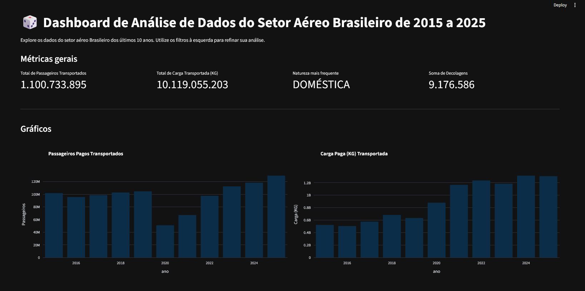
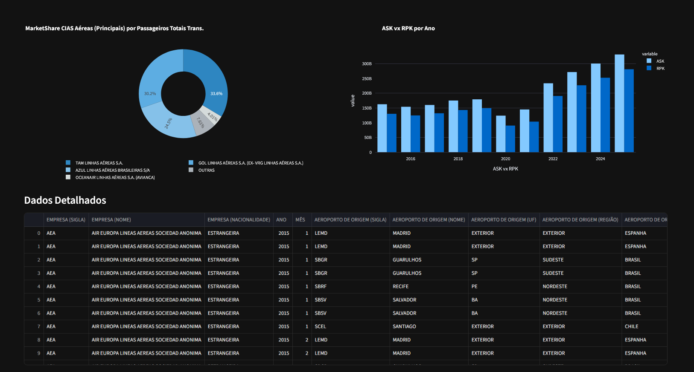

# Análise do Setor Aéreo Brasileiro (2015-2025)

Este projeto consiste em um pipeline de tratamento de dados e um dashboard interativo para análise da aviação civil brasileira. Utilizei dados públicos da ANAC para extrair insights sobre movimentação de passageiros, transporte de carga e market share das companhias aéreas.

Este trabalho foi desenvolvido como uma extensão da Imersão de Dados da Alura (fevereiro/2026). Utilizei a base técnica aprendida no curso, que focava em dados de mercado de trabalho, e adaptei todo o fluxo de ETL e visualização para o contexto do setor aéreo.

## 🛠 Tecnologias Utilizadas
* Python (Pandas para manipulação de dados)
* Streamlit (Construção do dashboard)
* Plotly (Visualização interativa)

## 📁 Estrutura do Projeto
- `py.ipynb`: Notebook com o processo de limpeza (ETL). Tratei valores nulos, removi duplicatas e filtrei apenas por oos produtivos.
- `app.py`: Aplicação Streamlit que gera o dashboard com filtros dinâmicos.
- `requirements.txt`: Dependências do projeto.

## 🚀 Como rodar
1. Clone o repositório.
2. Instale as dependências: `pip install -r requirements.txt`
3. Execute o app: `streamlit run app.py`

## Fonte dos dados
Dados públicos disponibilizados pela ANAC:
https://www.google.com/url?q=https%3A%2F%2Fwww.gov.br%2Fanac%2Fpt-br%2Fassuntos%2Fdados-e-estatisticas%2Fdados-estatisticos%2Fdados-estatisticos
Acesso em: 08 de fev. 2026.

## Dados

Os dados utilizados neste projeto são públicos e disponibilizados pela ANAC.
Devido ao tamanho dos arquivos, a base bruta não está disponível neste repositório.

Para reproduzir o projeto:
1. Baixe os dados no site da ANAC
2. Coloque o arquivo na pasta data/
3. Execute o notebook py.ipynb para gerar o df_limpo

## 📊 Dashboard

## 📊 Principais Insights
* Recuperação e Crescimento: O mercado não apenas se recuperou da queda observada durante a pandemia, como superou o volume de passageiros de 2019, podendo indicar um setor aéreo aquecido.
* Transporte de Cargas: Observa-se que o mercado de cargas ganhou espaço no pós-pandemia, passando por uma leve desaceleração em 2023, uma retomada de alta em 2024 e mantendo-se estável em 2025.
* Em relação às companhias aéreas nacionais, a Azul lidera o mercado brasileiro, seguida por Latam e Gol. 
* Os dados de ASK e RPK evidenciam recuperação gradual do setor, superando níveis pré-pandemia, com aumento tanto da oferta de voos quanto da demanda por transporte aéreo. A relação entre os indicadores também indica níveis consistentes de ocupação das aeronaves.